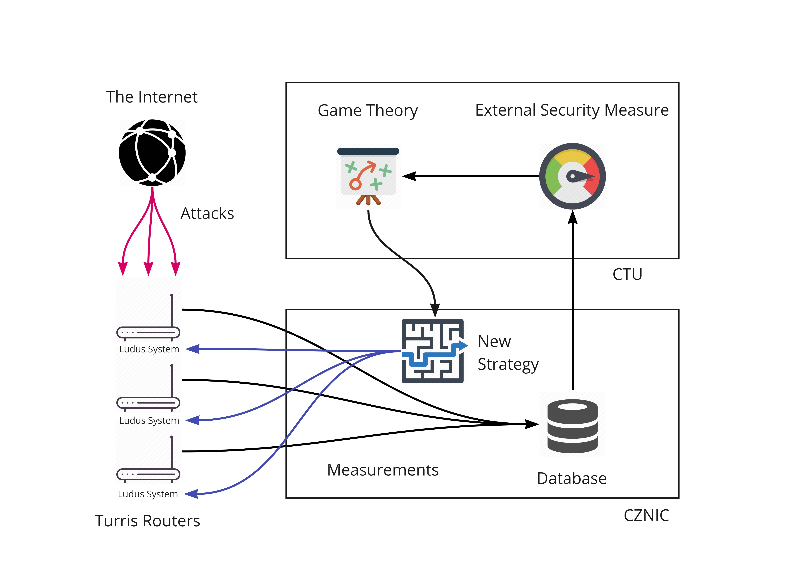

# Ludus
The Ludus system is free, open-source tool for OpenWRT based devices which fully automates honeypot deployment. By using collaborative approach in network security, it allows users to team up and help each other to better secure their devices. Ludus analyzes how is each device being used, how it is being attacked and then uses gathered information to create a defense strategy for all users. Game theory is used to model the interaction between the attakers and Ludus-protected devices. Main tool for defending a device is a honeypot. It stalls the attacker and while doing so, it gathers information about the course of attack which can be further used for imporving the model and the strategy itself.

## Structure of Ludus system
Ludus System consists of several tools
* IPtables Analyzer
* Suricata
* Suricata-Extractor
* Strategy-Generator

### IPtables Analyzer
The purpose of our tool IPtables Analyzer is to find out how each router is being used. We analyze the iptables of settings of the router and extract set of production ports. Production port is a port that is actively used (there is a service running, port is forwarded to another port etc.) Production ports are in fact the ports, which users need to protect the most. Additionally, no honeypots can be deployed in those ports.

### Suricata Extractor
Suricata is free network threat detection software designed for real-time intrusion detection and network security monitoring. It is a rule-based engine which means it compares the traffic with a set of rules and generates alerts if any of the rules triggers. It is the main source of information for Ludus. Suricata generates flows, which are later procesed by Ludus. Flow is a aggregated information about individual connections. It contains the IP addresses of both source and destination, source and destitantion ports, protocol and timestamp of the connection. Morover, it counts the bytes and packets transfered in the connection. Content of the packets is not inspected nor stored in any way. 

Apart from flows, Suricata IDS genarates alerts based on the set of rules.

### Strategy generator
Solving the game and subsequently generating a set of strategies is a task which requires a lot of computational power. Since Ludus is designed to run on routers which lack the resources, game model is precomputed and distributed to the routers. Strategy generator uses the information about the usage of the particular device and chooses the most suitable strategy - set of ports to be used as honeypots. Currently Ludus uses the Cowrie SSH honepot. Telnet minipot developed by CZ.NIC and TARPIT module of iptables. Framework can extended with additional honeypot systems.

### Ludus
Ludus.py is a main program of the system. It controls all submodules of the Ludus system described above. Ludus program is designed to run iteratively. For that the concept of time windows is used. It divides the time continuum into discrete parts that can be analysed individually. With discrete time windows we can use external measurements to estimate the quality of the strategy and further improve the game model.

In every iteration two major actions are performed. Firstly, using the submodules it gathers the information necessary for computing the security metrics. For that we use the Suricata Extractor.  This information is stored in the log file and send to the CZNIC afterwards. Second task for Ludus is to analyze the settings of the router and apply the strategy consistent with the setup. IPTables Analyzer takes key part in this process. Since the strategy is based on probability it is only being changed if any of following criteria is met:

* Changes in the settings of router
* Changes in Strategy file
* Current strategy exceeds TTL( time to live)

### System Requirements
Ludus runs Python 3. It has been tested in Turris and Turris Omnia routers. 

