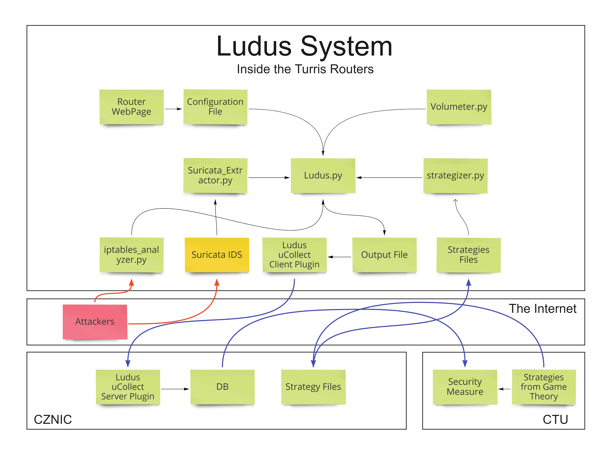

# Ludus
The Ludus system is a group of tools used for gathering information about the network in each of the Turris routers and applying the defence strategy gained from the Game Theory model. Since we use plenty of features for computing the Security Measure and the data comes from different sources and sensors, each tool collects data from one source. 

## Structure of Ludus system
Ludus System consists of several tools
* Volumeter
* IPtables Analyzer
* Suricata
* Suricata-Extractor

